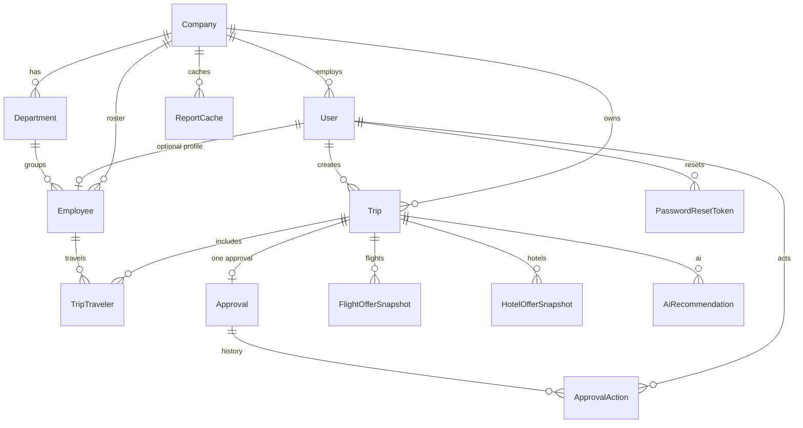

# Database Design (Milestone 3)

Source of truth for the relational model is `server/prisma/schema.prisma`.  
This document must stay **1:1** with that schema.

## ERD



## Entity dictionary

| Entity | Purpose |
|--------|---------|
| `Company` | Tenant organization |
| `User` | Auth identity + role (`SUPER_ADMIN` may have null `companyId`) |
| `PasswordResetToken` | Hashed one-time reset tokens |
| `Department` | Org unit within a company |
| `Employee` | Company roster person; optional 1:1 link to `User` |
| `Trip` | Business trip aggregate |
| `TripTraveler` | Group travel membership (`trip` + `employee`) |
| `Approval` | Current approval state for a trip (1:1) |
| `ApprovalAction` | Immutable approval audit trail |
| `FlightOfferSnapshot` | Stored flight search/selection payload |
| `HotelOfferSnapshot` | Stored hotel search/selection payload |
| `AiRecommendation` | Stored AI recommendation output |
| `ReportCache` | Cached analytics payloads per company/report key |

## Enums

| Enum | Values |
|------|--------|
| `UserRole` | `SUPER_ADMIN`, `COMPANY_ADMIN`, `EMPLOYEE` |
| `UserStatus` | `ACTIVE`, `INACTIVE` |
| `CompanyStatus` | `ACTIVE`, `INACTIVE` |
| `TripStatus` | `DRAFT`, `PENDING_APPROVAL`, `APPROVED`, `REJECTED`, `IN_PROGRESS`, `COMPLETED`, `CANCELLED` |
| `ApprovalStatus` | `PENDING`, `APPROVED`, `REJECTED` |
| `ApprovalActionType` | `SUBMIT`, `APPROVE`, `REJECT`, `COMMENT` |
| `TravelClass` | `ECONOMY`, `PREMIUM_ECONOMY`, `BUSINESS`, `FIRST` |
| `OfferProvider` | `AMADEUS`, `MANUAL`, `OTHER` |

## Soft delete vs hard delete

| Decision | Detail |
|----------|--------|
| Soft delete | `Company`, `Department`, `Employee`, `Trip` use `deletedAt` (nullable). Application queries should filter `deletedAt: null`. |
| Employee travel fields | Optional `nationality`, `passportNumber`, `preferredAirport` on `Employee` (Milestone 5). |
| Hard delete / cascade | `PasswordResetToken` cascades with `User`. Trip child rows (`TripTraveler`, `Approval`, snapshots, AI rows) cascade with `Trip`. `ReportCache` cascades with `Company`. |
| Restrict | Deleting a `User` who created trips or approval actions is restricted while those rows exist. Deleting an `Employee` referenced by `TripTraveler` is restricted. |
| Company unlink | `User.companyId` uses `onDelete: SetNull` so removing a company does not destroy auth users (they become unassigned). |

## Indexes (high-traffic)

- `User(companyId)`, `User(status)`, `User(role)`
- `Employee(companyId)`, `Employee(departmentId)`, `Employee(status)`
- `Trip(companyId)`, `Trip(status)`, `Trip(startDate,endDate)`, `Trip(createdByUserId)`
- `TripTraveler(employeeId)`, unique `(tripId, employeeId)`
- `Approval(status)` and unique `tripId`
- Offer snapshots indexed by `tripId` + `selected`
- `ReportCache` unique `(companyId, reportKey)` + `expiresAt`

## Milestone 2 reconciliation

- M2 left `User.companyId` as an untyped optional string.
- M3 promotes it to a real FK → `Company.id` (`SetNull` on company delete).
- Self-signup from M2 still creates users with `companyId = null` until Company Management (M4) assigns/creates a company.

## Seed

```bash
cd server
npm run prisma:seed
```

Creates:

| Item | Value |
|------|--------|
| Company | `acme-travel` |
| Super admin | `superadmin@seesight.local` / `SecurePass1` |
| Company admin | `admin@acme-travel.example` / `SecurePass1` |
| Employee user | `traveler@acme-travel.example` / `SecurePass1` |
| Departments | Engineering, Sales, Operations |
| Roster | 110+ seeded employees (`roster001@…`) for pagination demos |
| Sample trip | Berlin onboarding (`PENDING_APPROVAL`) with travelers, approval action, flight/hotel snapshots, AI recommendation, report cache |

## Migration discipline

- Never edit applied migrations under `server/prisma/migrations/`.
- Add additive migrations only after merge to `development`/`main`.
- M3 migration name: `domain_model_core_entities`.
